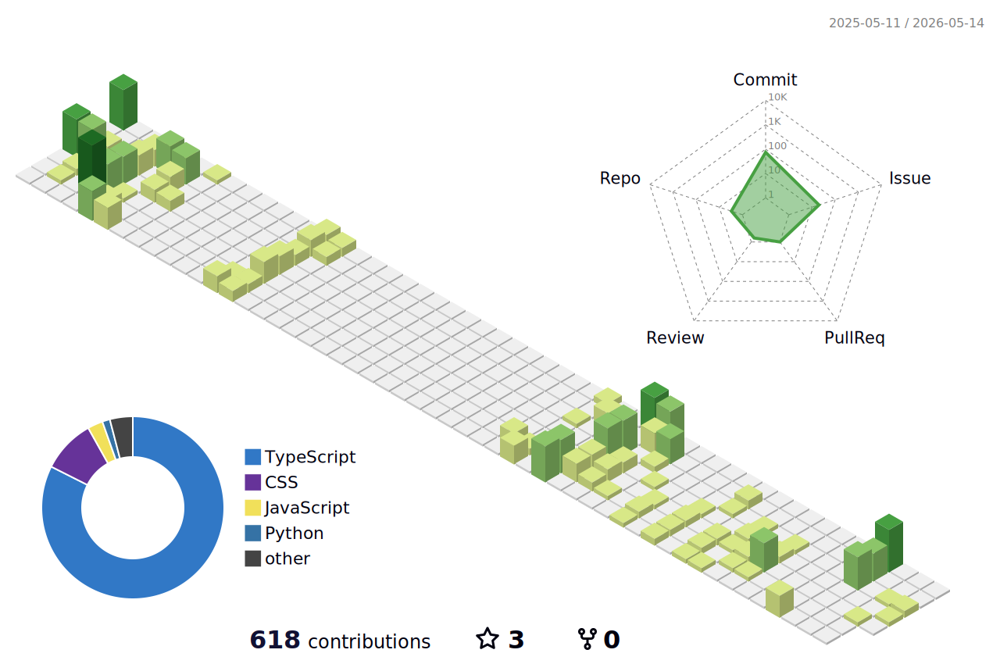

#  Hi, I'm [**Socrates**](https://socrabytes.github.io/) 

<!-- Code Snippet Intro -->

```python
#!/usr/bin/env python3
class DevOpsEngineer:
    def __init__(self):
        self.name = "Socrates Lopez"
        self.role = "DevOps Engineer"
        self.skills = ["Python", "Docker", "Kubernetes", "Terraform", "CI/CD Pipelines"]

    def say_hi(self):
        print("👋 Hello, and thanks for checking out my profile.")
        print(f"I specialize in cloud infrastructure and automation using tools 🛠️ like {', '.join(self.skills)}.")
        print("If your 👀 have made it this far, let me know by hitting that ⭐ button!")

    def invite_collaboration(self):
        print("I’m always open to collaboration. Let’s connect 🤝 and build something great together!")

# Instantiate the DevOpsEngineer class and call its methods
if __name__ == "__main__":
    socrates = DevOpsEngineer()
    socrates.say_hi()
    socrates.invite_collaboration()
```

<!-- Social badges section -->

<p align="center">
  <a href="https://socrabytes.github.io">
    </a>
  <a href="https://github.com/socrabytes?tab=followers">
    </a>
  <a href="https://github.com/socrabytes?tab=repositories&sort=stargazers">
    </a>
  <a href="https://github.com/socrabytes">
    </a>
  <a href="https://www.linkedin.com/in/socrateslopez/">
    </a>
</p>


<!-- Languages & Tools -->

##  Languages and Tools


<br clear="left"/>

<!-- 3D-Contribution Graph -->
<picture>
  <source media="(prefers-color-scheme: dark)" srcset="./profile-3d-contrib/profile-night-green.svg" />
  <source media="(prefers-color-scheme: light)" srcset="./profile-3d-contrib/profile-green-animate.svg" />
  
</picture>

<!-- GitHub Streak Counter and Language Distribution (Public) Card Row -->
<div style="display: flex; justify-content: space-between; align-items: center;">
  <!-- GitHub Streak Counter -->
  <picture>
    <source media="(prefers-color-scheme: dark)" srcset="https://streak-stats.demolab.com?user=socrabytes&theme=whatsapp-dark2&hide_border=true" />
    <source media="(prefers-color-scheme: light)" srcset="https://streak-stats.demolab.com?user=socrabytes&theme=whatsapp-light&hide_border=true" />
    
  </picture>

  <!-- Language Distribution (Public) Card -->
  <picture>
    <source media="(prefers-color-scheme: dark)" srcset="https://github-readme-stats.vercel.app/api/top-langs/?username=socrabytes&layout=compact&theme=chartreuse-dark&custom_title=Language%20Distribution%20(Public)&hide_border=true" />
    <source media="(prefers-color-scheme: light)" srcset="https://github-readme-stats.vercel.app/api/top-langs/?username=socrabytes&layout=compact&theme=shadow_green&custom_title=Language%20Distribution%20(Public)&hide_border=true" />
    
  </picture>
</div>


<!-- GitHub Snake Game -->
<picture>
  <source media="(prefers-color-scheme: dark)" srcset="dist/github-snake-dark.svg" />
  <source media="(prefers-color-scheme: light)" srcset="dist/github-snake.svg" />
  
</picture>


<!--
**socrabytes/socrabytes** is a ✨ _special_ ✨ repository because its `README.md` (this file) appears on your GitHub profile.

Here are some ideas to get you started:

- 🔭 I’m currently working on ...
- 🌱 I’m currently learning ...
- 👯 I’m looking to collaborate on ...
- 🤔 I’m looking for help with ...
- 💬 Ask me about ...
- 📫 How to reach me: ...
- 😄 Pronouns: ...
- ⚡ Fun fact: ...
-->
