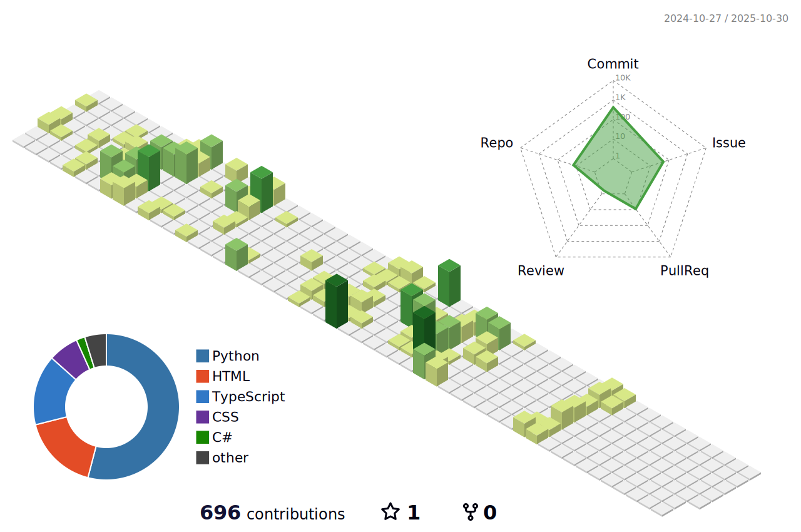

#  Hi, I'm [**Socrates**](https://socrabytes.github.io/) 

`🛠️ Systems-minded Engineer | ☁️ Cloud-Native Thinker | 🧠 Infra-Aware AI Builder`

I build automated systems, scale cloud-native infrastructure, and connect DevOps to AI-driven workflows.

- 🔭 **Current Focus:**
  - Improving resilience and performance in *CI/CD pipelines* and *Kubernetes deployments*
  - Integrating LLMs into container-native workflows using background task queues and API orchestration

- 🚧 **Actively Experimenting With:**
  - Home lab architecture (Proxmox + Kubernetes on mini-PCs)
  - Local LLM inference, GPU tuning, and vector database workflows
  - Evolving *YouTube Digest* into a multi-user platform with authentication and dashboarding

🖥️ **Beyond Code:** 🚴‍♂️ Cycling enthusiast, ☕ Coffee aficionado, and passionate about exploring emerging tech trends.

```python
def greet():
    """Simple is better than complex. - The Zen of Python"""
    name = "Socrates Lopez"
    print(f"👋 Hi, I'm {name}!")
    print("I design, build, and automate.")
    print("Let's connect!")

# Elegance in simplicity
greet()
```

<!-- Social badges section -->

<p align="center">
  <a href="https://socrabytes.github.io">
    </a>
  <a href="https://github.com/socrabytes?tab=followers">
    </a>
  <a href="https://github.com/socrabytes?tab=repositories&sort=stargazers">
    </a>
  <a href="https://github.com/socrabytes">
    </a>
  <a href="https://www.linkedin.com/in/socrateslopez/">
    </a>
</p>

<!-- Languages & Tools -->

##  Languages and Tools

### Infrastructure & DevOps:


<br clear="left"/>

### Languages & Frameworks:


<br clear="left"/>

### Data & Monitoring:


<br clear="left"/>

### Tools & Platforms:


<br clear="left"/>

<!-- Featured Projects -->

## 🚀 Featured Projects

### 🎬 [YouTube Digest](https://github.com/socrabytes/youtube-digest)

*A full-stack AI-driven summarizer for YouTube videos.*

[](https://github.com/socrabytes/youtube-digest)  

<p align="center">
  <a href="https://github.com/socrabytes/youtube-digest" target="_blank">
    
  </a>
</p>

> **Tech Stack:** `Next.js 15` • `FastAPI` • `PostgreSQL` • `OpenAI` • `Docker`

- 🧠 GPT-generated summaries with token tracking
- 📦 Background workers and task queues
- 📺 Optimized UX for rapid content skimming

---

### 🌐 [Personal Website](https://socrabytes.github.io) 
*My personal portfolio and technical blog, built for performance and maintainability.*

[](https://github.com/socrabytes/socrabytes.github.io) [](https://socrabytes.github.io)  
<p align="center">
  <a href="https://socrabytes.github.io" target="_blank">
    
  </a>
</p>

> **Tech Stack:** `Hugo` • `GitHub Actions` • `GitHub Pages`

- ⚡ Lightning-fast static portfolio & blog
- 🧰 Fully version-controlled content pipeline
- 🎨 Designed for showcasing DevOps + AI notes

## 📊 Stats and Contributions

<!-- 3D-Contribution Graph -->
<picture>
  <source media="(prefers-color-scheme: dark)" srcset="./profile-3d-contrib/profile-night-green.svg" />
  <source media="(prefers-color-scheme: light)" srcset="./profile-3d-contrib/profile-green-animate.svg" />
  
</picture>

<!-- GitHub Snake Game -->
<picture>
  <source media="(prefers-color-scheme: dark)" srcset="dist/github-snake-dark.svg" />
  <source media="(prefers-color-scheme: light)" srcset="dist/github-snake.svg" />
  
</picture>

<!-- GitHub Streak Counter and Language Distribution (Public) Table -->
<table>
  <tr>
    <td>
      <!-- GitHub Streak Counter -->
      <picture>
        <source media="(prefers-color-scheme: dark)" srcset="https://streak-stats.demolab.com?user=socrabytes&theme=vue-dark&hide_border=true&bg_color=00000000" />
        <source media="(prefers-color-scheme: light)" srcset="https://streak-stats.demolab.com?user=socrabytes&theme=vue&hide_border=true" />
        
      </picture>
    </td>
    <td>
      <!-- Language Distribution (Public) Card -->
      <picture>
        <source media="(prefers-color-scheme: dark)" srcset="https://github-readme-stats.vercel.app/api/top-langs/?username=socrabytes&layout=compact&theme=vue-dark&custom_title=Language%20Distribution%20(Public)&hide_border=true&bg_color=00000000" />
        <source media="(prefers-color-scheme: light)" srcset="https://github-readme-stats.vercel.app/api/top-langs/?username=socrabytes&layout=compact&theme=vue&custom_title=Language%20Distribution%20(Public)&hide_border=true" />
        
      </picture>
    </td>
  </tr>
</table>


## 📫  Let’s Connect

Whether you're building something ambitious or exploring new ideas, feel free to reach out. You can connect with me here:

- 💼 [LinkedIn](https://linkedin.com/in/socrateslopez)
- 🌐 [Website](https://socrabytes.github.io)

Don't forget to ⭐ my projects if you find them helpful!